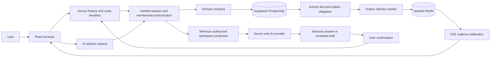

# Saathi v1 project map

**Status:** Working beta baseline
**Date:** 2026-09-15
**Purpose:** One repository-grounded view of the product journey, architecture ownership, FR/NFR status, validation gates, and clean beta release shape.

This document is the project map for Saathi v1. It is derived from the current repository implementation and the product/architecture documents. The attached visual map is a presentation reference; this document is the source of truth for scope and status.

## 1. Product outcome

Saathi helps a small team turn one shared outcome into visible, assigned, and completed work. The v1 boundary is deliberately flat:

```text
workspace -> task
```

The complete experience is:

```text
Landing
  -> authenticate
  -> create or join a workspace
  -> understand the shared outcome
  -> focus on today's work
  -> plan and manage tasks
  -> collaborate through membership, comments, and activity
  -> ask AI for grounded advice
  -> review and confirm any proposed change
  -> reconcile safely after errors or reconnects
```

## 2. End-to-end architecture



### Authoritative ownership

| Area | Authority | Repository owner | Rule |
| --- | --- | --- | --- |
| Identity and sessions | Supabase Auth | `lib/auth-simple.ts`, `lib/supabase/` | Server-verified identity is authoritative |
| Profiles | PostgreSQL projection | `lib/data/profiles.ts` | Profile ID matches Auth user ID |
| Workspaces and membership | PostgreSQL | `lib/data/workspaces.ts` | Membership is the access relationship; owner is `owner_user_id` |
| Tasks | PostgreSQL | `lib/data/tasks.ts` | One workspace, one creator, zero/one member assignee |
| Comments | PostgreSQL | `lib/data/comments.ts` | Append-only member-authored task context |
| Activity | PostgreSQL | `lib/data/events.ts` | Audit projection; never an authorization source |
| Delivery obligation | PostgreSQL outbox | `lib/data/events.ts`, `app/api/internal/outbox/route.ts` | Created with the domain mutation |
| Temporary state | Redis | `lib/redis.ts`, `lib/rate-limit.ts`, `lib/sse-connection.ts` | Rate limits, claims, presence, and stream delivery only |
| Realtime transport | Redis Streams + SSE | `lib/realtime.ts`, `app/api/realtime/route.ts` | Notification only; clients reconcile from PostgreSQL |
| Email delivery | PostgreSQL queue + provider | `lib/data/invitation-emails.ts`, `lib/email-delivery.ts` | Provider acceptance is not inbox delivery |
| AI interpretation | Server-only provider adapter | `lib/groq-chat.ts`, `lib/ai/` | AI suggests; deterministic commands authorize and persist |

## 3. User journey and capability map

### Stage 1 — Public and authentication

| Capability | Route/module | Status |
| --- | --- | --- |
| Landing and product explanation | `app/landing/page.tsx` | Implemented in code; manual beta verification pending |
| Login | `app/(auth)/login/page.tsx`, `lib/auth-simple.ts` | Implemented in code; manual beta verification pending |
| Registration and email confirmation | `app/(auth)/register/page.tsx`, `lib/auth-simple.ts` | Implemented in code; provider configuration pending |
| Forgot/reset password | `app/(auth)/forgot-password/`, `app/(auth)/reset-password/` | Implemented in code; manual email-flow verification pending |
| OAuth callback and auth errors | `app/auth/callback/`, `app/auth/error/` | Implemented in code; provider/deployment verification pending |
| Logout and session recovery | `lib/auth-simple.ts`, `app/dashboard/page.tsx` | Implemented in code; manual verification pending |

### Stage 2 — Workspace entry

| Capability | Route/module | Status |
| --- | --- | --- |
| Load current user's workspaces | `app/actions/workspaces.ts`, `lib/data/workspaces.ts` | Implemented in code |
| Explicit loading/error/zero-workspace state | `lib/dashboard-state.ts`, `app/dashboard/page.tsx` | Implemented in code; manual verification pending |
| Create workspace manually | `app/actions/workspaces.ts`, `lib/data/workspaces.ts` | Implemented in code |
| Create workspace from reviewed AI plan | `app/actions/workspace-intent.ts` | Implemented in code; optional provider path unverified |
| Select and switch workspace | `components/workspace-switcher.tsx`, `hooks/use-workspaces.ts` | Implemented in code |
| Product guide and help | `app/guide/`, `app/help/` | Implemented in code |
| Archived workspace lifecycle | `workspaces.archived_at`, workspace reads | Implemented in code; live database and manual lifecycle verification pending |

### Stage 3 — Core execution

| Capability | Route/module | Status |
| --- | --- | --- |
| Execution Overview | `components/workspace-overview.tsx`, `lib/task-overview.ts` | Implemented in code; UX/manual validation pending |
| Task Board | `components/task-list.tsx`, `app/tasks/page.tsx` | Implemented in code; UX/manual validation pending |
| Create task | `app/tasks/actions.ts`, `lib/data/tasks.ts` | Implemented in code |
| Edit task | `app/tasks/actions.ts`, `lib/task-draft.ts` | Implemented in code |
| Assign task to a member | `lib/data/tasks.ts`, `hooks/use-workspaces.ts` | Implemented in code |
| Complete/reopen task | `lib/data/tasks.ts`, task permission contract | Implemented in code |
| Delete task | `lib/data/tasks.ts` | Implemented in code |
| Task status and priority | `app/tasks/contract.ts`, database checks | Implemented with UI/database translation |
| Date-only and precise deadline | `lib/task-deadline.ts`, `lib/task-time.ts` | Implemented in code with workspace-timezone Today/target rendering; existing data and manual validation pending |
| Search and filtering | `components/task-filter.tsx`, `components/task-list.tsx` | Implemented in code |
| CSV import | `app/actions/migration.ts`, `lib/csv.ts` | Implemented in code |

### Stage 4 — Collaboration and control

| Capability | Route/module | Status |
| --- | --- | --- |
| Member list | `components/member-manager.tsx`, workspace projection | Implemented in code |
| Invite member | `app/actions/invitations.ts`, invitation data modules | Implemented in code; a recipient need not already have an account; email delivery pending verification |
| Accept/decline/revoke/expire invitation | `lib/data/invitations.ts`, invitation route | Implemented in code; invitation link supports account creation or sign-in; two-user/manual verification pending |
| Remove member and unassign open tasks | `lib/data/workspaces.ts` | Implemented in code; manual verification pending |
| Ownership controls | Workspace owner checks, `app/actions/workspaces.ts` | Implemented in code; two-user/manual verification pending |
| Workspace settings | `components/workspace-settings.tsx` | Implemented in code; live archive/delete/transfer verification pending |
| Task comments | `components/task-comments.tsx`, `lib/data/comments.ts` | Implemented in code; manual collaboration verification pending |
| Activity/history | `lib/data/activity.ts`, `components/activity-history.tsx` | Implemented as a read-only user surface; two-user/manual verification pending |

### Stage 5 — AI assistance

| Capability | Route/module | Status |
| --- | --- | --- |
| Workspace summary | `app/actions/workspace-advisor.ts`, `lib/ai/` | Implemented behind feature flag; provider verification pending |
| Attention items | `lib/ai/workspace-advisor.ts`, advisor UI | Implemented as advisory output; task-linking and grounding need manual validation |
| Reviewed task draft | `components/workspace-advisor.tsx` | Implemented; uses deterministic task creation after confirmation |
| AI authorization boundary | `app/actions/workspace-advisor.ts` | Implemented in code |
| Structured response validation | `lib/ai/workspace-advisor.ts`, `lib/groq-chat.ts` | Implemented in code |
| AI operational metadata | `lib/data/ai-operations.ts` | Implemented structurally; real cost accounting is incomplete |
| AI conversation history | Not implemented | Explicitly deferred |
| Autonomous AI writes | Not implemented | Explicitly deferred |

### Stage 6 — System states and operations

| Capability | Route/module | Status |
| --- | --- | --- |
| Liveness | `app/api/health/live/route.ts` | Implemented in code |
| Readiness | `app/api/health/ready/route.ts` | Implemented in code; deployed dependency validation pending |
| Authenticated SSE | `app/api/realtime/route.ts` | Implemented in code; authenticated benchmark not yet run |
| Reconnect and resync | `lib/realtime-sse.ts`, `hooks/useRealtime.ts` | Implemented in code; two-user/browser verification pending |
| Outbox retry | `lib/data/events.ts`, internal worker route | Lease and deferred delivery implemented; real migration, worker, and metrics verification pending |
| Email delivery retry | `lib/data/invitation-emails.ts` | Implemented in code; provider/webhook verification pending |
| Usage metrics | `app/api/usage/route.ts`, `lib/usage.ts` | Implemented in code; deployed validation pending |
| Backup and restore | External infrastructure | Not verified; beta release gate |

## 4. Functional requirement baseline

| ID | Requirement | Code assessment |
| --- | --- | --- |
| FR-1 | Authenticate users and maintain a verified profile | Implemented locally; provider/manual verification pending |
| FR-2 | Enforce workspace membership for reads, writes, comments, realtime, and AI | Implemented in main server paths; manual negative-path verification pending |
| FR-3 | Create, edit, archive, and delete workspaces | Implemented in code; live lifecycle verification pending |
| FR-4 | Maintain one owner and unique membership | Implemented in schema/design; live database test pending |
| FR-5 | Invite and safely accept, decline, revoke, and expire invitations | Implemented in code; two-user/email verification pending |
| FR-6 | Create, assign, edit, complete, reopen, filter, import, and delete tasks | Implemented locally |
| FR-7 | Enforce task permissions and optimistic concurrency | Implemented locally; concurrent browser verification pending |
| FR-8 | Preserve date-only, precise-time, timezone, Today, Next, and overdue semantics | Implemented in code; persisted-data and manual timezone verification remain gates |
| FR-9 | Add immutable comments and meaningful activity history | Implemented in code; two-user/manual verification pending |
| FR-10 | Notify collaborators and reconcile after reconnect or missed events | Implemented in code; end-to-end verification pending |
| FR-11 | Provide grounded workspace AI and reviewed task drafts | Implemented behind an optional flag; provider and grounding verification pending |
| FR-12 | Ensure AI writes use normal deterministic authorization and persistence | Implemented in code |

## 5. Non-functional requirement baseline

| ID | Requirement | Code assessment |
| --- | --- | --- |
| NFR-1 | PostgreSQL is the durable source of truth | Implemented by architecture and data modules |
| NFR-2 | Domain state, activity, and outbox commit atomically | Implemented in transaction paths; live database proof pending |
| NFR-3 | Realtime failure cannot become data loss | Implemented conceptually through PostgreSQL reconciliation; browser proof pending |
| NFR-4 | Retried mutations are idempotent or conflict-safe | Implemented in key paths; concurrency proof pending |
| NFR-5 | Authorization uses verified server identity and current membership | Implemented in main paths |
| NFR-6 | AI cannot authorize, persist, or claim an uncommitted mutation | Implemented |
| NFR-7 | Raw AI content and secrets are not retained or logged | Implemented by current adapter/logging design; deployment log review pending |
| NFR-8 | Input and payload sizes are bounded | Implemented through Zod, action limits, and database checks |
| NFR-9 | Loading, empty, error, conflict, offline, and permission states are explicit | Partial; manual browser review required |
| NFR-10 | Keyboard, focus, labels, responsive layout, and date display are usable | Partial; manual desktop/mobile review required |
| NFR-11 | Requests and realtime connections are rate limited | Implemented locally with Redis-backed controls |
| NFR-12 | Outbox, email, health, retention, and failures are observable | Core status and retry signals implemented; deployed metrics and provider verification pending |
| NFR-13 | Performance claims are backed by measured evidence | Not verified; authenticated SSE benchmark remains outstanding |
| NFR-14 | Deployed behavior matches the verified code and configuration | Not verified; clean beta deployment gate |

## 6. Clean beta release topology

The beta should have one intentional runtime path:

```text
Git branch under verification
  -> one Vercel beta project/deployment
  -> one Supabase Auth/PostgreSQL environment
  -> one Redis environment
  -> one Resend/email configuration
```

Rules:

1. Do not let Preview deployments use production database, Redis, email, or secrets.
2. Do not let Production use unverified Preview-only configuration.
3. Keep public browser configuration limited to the Supabase URL, publishable key, app origin, and deliberate feature flags.
4. Keep database, Redis, email, scheduler, and AI credentials server-only.
5. Verify code and FR/NFR behavior before changing external configuration.
6. Record the current deployment/configuration shape before deleting or recreating anything.
7. Reset disposable beta data only after confirming that Auth users, domains, webhooks, and provider configuration are not needed.
8. Keep a rollback reference to the last known deployment until the clean beta is manually accepted.

The clean setup is a release operation, not a prerequisite for understanding the product contract. It should happen after the code and manual validation baseline is accepted.

## 7. Manual beta validation gates

Manual validation should proceed in this order:

1. Sign up, confirm, log in, reset password, and log out.
2. Create a workspace and verify the zero-workspace/loading/error transitions.
3. Create, edit, assign, complete, reopen, filter, import, and delete tasks.
4. Validate current-year dates, timezone behavior, date-only deadlines, precise deadlines, Today, Next, and overdue work.
5. Validate owner/member permissions and removed-member behavior.
6. Validate invitation creation, wrong-recipient rejection, acceptance, duplicate acceptance, expiry, revoke, and email status.
7. Validate comments, activity, optimistic conflicts, and two-user collaboration.
8. Disconnect and reconnect realtime; verify PostgreSQL reconciliation after missed events.
9. Validate AI workspace isolation, grounded answers, reviewed drafts, provider failure, disabled mode, and rate limits.
10. Validate health, readiness, error recovery, responsive layout, keyboard navigation, and deployment configuration.

For each gate, record:

```text
Requirement:
Expected:
Observed:
Pass / Fail / Partial:
Architecture owner:
Evidence:
```

## 8. Deferred v1 scope

These are deliberately outside the initial completion gate:

- organizations and departments;
- projects, epics, subtasks, and custom workflows;
- multiple assignees, labels, attachments, reactions, and rich text;
- billing and subscriptions;
- broad third-party integrations or an integration marketplace;
- native mobile applications;
- autonomous AI mutations;
- durable AI conversation history;
- new realtime transports without measured need.

## 9. Code priorities after the map

The map becomes the work queue. The recommended implementation order is:

1. Complete the manual FR/NFR validation gates against real dependencies.
2. Resolve any correctness blockers found in two-user, realtime, invitation, and AI validation.
3. Verify migrations, outbox delivery, email status, readiness, backups, and measured SSE performance.
4. Consolidate the beta Vercel/Supabase/Redis/Resend configuration.
5. Apply UI/UX refinement after FR/NFR correctness is accepted.
6. Add focused component and integration tests around validated behavior.

This order keeps the core product authoritative and reliable while allowing the AI layer to remain useful, bounded, and replaceable.
