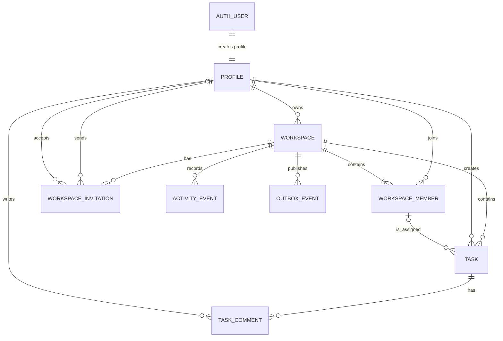
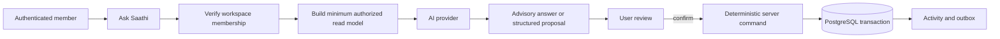

# Saathi v1 technical architecture

**Status:** Repository-grounded beta baseline; manual release validation pending
**Date:** 2026-09-16
**Companion:** [Product requirements](../product/saathi-v1-product-requirements.md)

## 1. Architecture decision

Saathi remains a modular Next.js monolith. Supabase Auth owns identity and sessions. Supabase PostgreSQL owns all durable domain data. Server Actions and route handlers own command authorization and transactions. Redis provides bounded rate limiting, presence, idempotency claims, and realtime stream coordination. SSE tells clients to reconcile; it is not the persistence protocol.

## 2. Domain relationship model

`workspace_members` is the authoritative relationship between a profile and a workspace. Ownership is **not** a member role: it is the `workspaces.owner_user_id`, protected by a deferred foreign key that requires the owner to be a member.

## 3. Durable entities and invariants

### Existing entities retained

| Entity | Authoritative facts | Key invariants |
| --- | --- | --- |
| `profiles` | Saathi identity projection | ID equals Supabase Auth user ID |
| `workspaces` | Goal, timezone, owner, archive state | Exactly one owner; owner is a member |
| `workspace_members` | Membership and join time | Composite primary key prevents duplicates |
| `workspace_invitations` | Pending and resolved access requests | One pending invitation per workspace/email |
| `tasks` | Work records | One workspace; assignee must be a member |
| `activity_events` | Immutable audit projection | Never authorizes a command |
| `outbox_events` | Durable delivery obligation | Inserted with its domain mutation |

### Delivered v1 entity: `task_comments`

Comments are required for collaborative task context and must not be stored inside task JSON or activity metadata.

| Column | Type | Rule |
| --- | --- | --- |
| `id` | UUID | primary key |
| `workspace_id` | UUID | FK to workspace; used for membership authorization |
| `task_id` | UUID | FK to task; cascade on task deletion |
| `author_user_id` | UUID | FK to profile; must be a current workspace member at write time |
| `body` | varchar(2000) | trimmed, non-empty, plain text |
| `created_at` | timestamptz | server generated |

Comments are append-only in v1. They remain while the workspace exists and are deleted when that workspace is permanently deleted. A comment creation transaction also inserts a task activity event and outbox event. If legal or operational requirements later require audit retention, retain only a minimal anonymized audit fact; do not retain comment bodies after workspace deletion by default.

## 4. Canonical relationship rules

1. A profile can belong to many workspaces; a workspace has many profiles through `workspace_members`.
2. A workspace has one owner. The owner may transfer ownership only to an existing member in the same transaction.
3. An invitation is an access request, not membership. It becomes membership only after the intended authenticated recipient accepts it.
4. An email is an invitation delivery address, not an authorization principal. Acceptance binds to the verified signed-in profile.
5. A task is never moved between workspaces in v1. Copying creates a new task with a new history.
6. A task has one creator and zero or one assignee. The assignee relation references `(workspace_id, user_id)` to prevent cross-workspace assignment.
7. Removing a member clears task assignment first, appends activity/outbox events, then removes membership. A removed member loses access immediately.
8. An archived workspace rejects task, comment, invitation, and AI write commands. Reads are allowed only to current members until product retention rules say otherwise.

## 5. Command and authorization matrix

| Command | Actor | Transactional work |
| --- | --- | --- |
| Create workspace | Authenticated user | Workspace + owner membership + activity + outbox |
| Edit/archive/delete workspace | Owner | Verify ownership and expected version; mutate + activity + outbox |
| Invite/revoke/remove member | Owner | Verify ownership; enforce membership/invite state; mutate + activity + outbox |
| Accept invitation | Intended authenticated recipient | Lock invitation; verify email/state/expiry; insert membership once; transition once; activity + outbox |
| Create task | Member | Verify membership/unarchived workspace; insert task + activity + outbox |
| Edit/delete task | Owner or task creator | Lock task; verify expected version; mutate + activity + outbox |
| Complete/reopen task | Assignee, creator, or owner | Lock task; verify membership/version; mutate + activity + outbox |
| Add comment | Member | Verify membership/unarchived task; insert comment + activity + outbox |
| Ask AI | Member | Verify membership; construct a minimum authorized read model; record operational audit only |
| Confirm AI proposal | Member with target command permission | Re-run deterministic command validation and authorization; do not trust AI output |

## 6. Data standards

### Dates and timezone

- `workspace.timezone` is a validated IANA timezone.
- A date-only commitment uses `tasks.due_date` and is rendered in workspace local date.
- A precise deadline uses `tasks.due_at` as `timestamptz`.
- The database check constraint requires one or neither, never both.
- `bucket` is a UI planning projection. It cannot silently change `status` or due facts.
- `blocked` is not a persisted task status in v1. AI may identify likely blockers from overdue or inactive work, but this remains advisory and cannot change task state.

### State, audit, and concurrency

- Database values use `in_progress`; the UI contract may map it to `in-progress`.
- `tasks.version` and `workspaces.version` implement optimistic concurrency. Update statements match `(id, version)`, increment on success, and return current data on conflict.
- `activity_events.metadata` contains only safe, schema-versioned event facts. It must not become a dumping ground for task fields or personal data.
- `outbox_events` has an immutable event ID. Delivery may retry; consumers treat it as a deduplication hint and reload authoritative state.

## 7. Realtime and failure model

1. A successful transaction commits domain change, activity event, and outbox event together.
2. An outbox worker publishes a notification to the workspace stream and marks the outbox event published.
3. SSE subscribers verify session and membership before opening a workspace stream.
4. On reconnect, stream gap, or stale cursor, the browser refetches authoritative workspace/task data from PostgreSQL.
5. The product must not claim exactly-once realtime delivery. It guarantees authoritative reconciliation after delivery failures.

## 8. AI architecture and data boundary

AI is an application capability, not a domain authority.

- The request carries the selected workspace ID and task ID only after server membership checks.
- The server provides a purpose-limited projection, not arbitrary database access.
- Proposed task writes must validate against the same Zod contract as manual writes.
- AI provider failures, malformed proposals, and timeouts return a non-mutating failure. They never create partial records.
- A single provider is hidden behind a server-only adapter so provider configuration and credentials never reach the browser.
- Prompt text, model output, tokens, and sensitive task content are not logged or stored by default.
- The operational record contains only workspace ID, requesting user ID, capability, result category, latency, estimated cost, and timestamp. It is retained for 30 days, then aggregated or deleted.
- Durable conversation history is out of scope until a retention, export, deletion, and provider-data policy is approved.

## 9. Schema implementation status

The durable ownership, membership, invitation, task, activity, outbox, comment, and AI-operation foundations are implemented through the reviewed migrations in `drizzle/`.

1. `0003_task_comments` adds `task_comments` with foreign keys, `(task_id, created_at)` indexing, RLS enabled, and Data API privileges revoked.
2. `lib/data/comments.ts` verifies current workspace membership inside its transaction before reading or writing comments; no database trigger is relied on for this application-level authorization rule.
3. Comment creation appends a `task-comment-created` activity fact and durable outbox obligation in the same transaction.
4. Workspace timezones are validated as IANA identifiers at the command boundary. A task supports either `due_date` or `due_at`, never both; date-only values remain calendar commitments.
5. Existing indexes support the workspace board and task-comment query paths. Additional indexes need measured query evidence.

No generalized JSON custom-fields column, task labels, projects, or organization table belongs in v1.

## 10. Security controls

- Tables in the exposed `public` schema have RLS enabled and `anon`/`authenticated` table privileges revoked because server-side database transactions are the domain boundary.
- Supabase `user_metadata` is never used for authorization. Server-side verified identity plus current PostgreSQL membership decides access.
- No browser-visible environment variable contains a service-role key, direct database URL, Redis credential, or provider secret.
- If a direct Data API/read policy is added later, it needs separate review: `TO authenticated` alone is insufficient and every update policy requires both `USING` and `WITH CHECK`.

## 11. Implementation evidence and remaining acceptance gates

- Source and database suites cover owner membership, duplicate membership, invitation idempotency, assignment containment, task version conflicts, comment membership checks, archive-write rejection, and AI command validation. They are code-level evidence, not hosted release proof.
- Server actions return stable validation, authorization, conflict, and unavailable results; provider and browser behavior still need manual validation.
- Before beta acceptance, validate two users through invite/create-account-or-sign-in/accept/assign/comment/complete/reconnect flows on desktop and mobile widths.
- Before product claims change, run migration, type-check, lint, build, `git diff --check`, preview deployment checks, and the required manual FR/NFR gates.

## 12. Accepted v1 boundaries and later triggers

1. Comments are immutable and retained only while the workspace exists. Permanent workspace deletion deletes comment bodies; a minimal anonymized audit fact is retained only when a legal or operational obligation requires it.
2. Task status remains `todo`, `in_progress`, and `done`. A future `blockedReason` needs evidence that teams repeatedly need to explain blocked work.
3. AI uses one server-only provider adapter. No raw content is persisted by default; operational metadata is retained for 30 days before aggregation or deletion. Provider selection, evaluation, and cost limits remain implementation decisions with explicit acceptance criteria.
4. There is no organization entity in v1. Reconsider it when a customer needs shared members, billing, administrative controls, or cross-workspace visibility.
